# Luastar - 高性能 API 网关系统

[](LICENSE)
[](https://openresty.org/)
[](https://github.com/youlaitech/vue3-element-admin/)

**Luastar** 是一个基于 OpenResty（Nginx + Lua）构建的企业级 API 网关系统，配备完整的管理后台。项目采用前后端分离架构，提供了强大的网关功能和可视化管理界面，适用于微服务架构中的流量管理、安全控制和监控分析，也可以用来做 API 接口快速开发。

## ✨ 核心特性

### 🚀 高性能网关

- **事件驱动架构**：基于 OpenResty 的非阻塞 I/O 模型
- **LuaJIT 加速**：提供卓越的 Lua 代码执行性能
- **网关管理功能**：通过内网 Web 管理界面管理网关路由、拦截器、限流、熔断器等

### ⚡ 在线代码开发

- **在线 Lua 编码**：支持在管理界面直接编写 Lua 代码
- **热更新部署**：代码保存后几秒内自动生效，无需重启服务

### 📊 实时监控

- **流量统计**：实时的请求量和响应时间监控
- **性能分析**：详细的系统性能指标

## 🏗️ 系统架构

```
# 作为网关
A接口 -> Luastar网关 -> 路由规则 -> 拦截器 -> 控制器（转发控制器）-> 负载均衡 -> A 后端服务

# 作为接口服务器
A接口 -> Luastar网关 -> 路由规则 -> 拦截器 -> 控制器（Lua代码实现）-> 访问MySQL数据库或Redis缓存（Lua代码实现）

```

## 🛠️ 技术栈

### 后端技术

- **OpenResty 1.27.1.1** - 基于 Nginx 的 Web 平台
- **LuaJIT** - 高性能 Lua 虚拟机

### 前端技术

- **vue3-element-admin** - 基于 Vue 3 + Vite 7+ TypeScript + element-plus 构建的后台管理前端模板
  https://github.com/youlaitech/vue3-element-admin

## 📁 项目结构

```
luastar/
├── admin-backend/                 # 后端 Lua 代码
│   ├── config/                   # 配置文件
│   │   ├── app_dev.lua          # 应用配置
│   │   ├── i18n_zh_CN.lua       # 国际化配置
│   │   └── luastar-admin.sql    # 数据库结构
│   ├── src/                     # 源代码
│   │   ├── core/                # 核心模块
│   │   │   ├── request.lua      # 请求处理
│   │   │   ├── response.lua     # 响应处理
│   │   │   └── router.lua       # 路由核心
│   │   ├── modules/             # 业务模块
│   │   │   ├── controller/      # 控制器
│   │   │   ├── service/         # 业务逻辑
│   │   │   └── model/           # 数据模型
│   │   └── utils/               # 工具类
│   ├── scripts/                 # 脚本文件
│   │   ├── run.sh              # 启动脚本
│   │   └── nginx.conf.template # Nginx 配置模板
│   └── logs/                   # 日志文件
└── admin-frontend/               # 前端 Vue 代码
    ├── src/                     # 源代码
    │   ├── api/                 # API 接口
    │   ├── components/          # 公共组件
    │   ├── views/               # 页面视图
    │   │   ├── dashboard/       # 仪表板
    │   │   ├── gate/           # 网关管理
    │   │   ├── system/         # 系统管理
    │   │   └── monitor/        # 监控面板
    │   ├── router/              # 路由配置
    │   ├── stores/              # 状态管理
    │   └── utils/               # 工具函数
    ├── public/                  # 静态资源
    ├── dist/                    # 构建产物
    └── package.json            # 依赖配置
```

## 🚀 快速开始

### 环境要求

- **OpenResty** >= 1.27.1.1
  https://openresty.org/cn/installation.html

### 安装步骤

#### 1. 克隆项目

```bash
git clone https://github.com/luastar/luastar.git
cd luastar
```

#### 2. 数据库配置

```sql
-- 创建数据库 luastar-admin

-- 执行 SQL 语句
luastar/admin-backend/config/luastar-admin.sql

```

#### 3. 后端配置

编辑 `admin-backend/config/app_dev.lua` 文件：

```lua
-- Mysql 数据库配置
local mysql_config = {
  host = "127.0.0.1",
  port = "3306",
  user = "root",
  password = "root123",
  database = "luastar-admin",
  timeout = 3000,
  pool_size = 100
}

-- JWT 配置
local jwt_config = {
  secret = "your_jwt_secret_key",
  access_expire = 3600 * 2,
  refresh_expire = 3600 * 24 * 30,
}
```

#### 4. 前端安装

前端如果不修改，可以直接使用；
如果修改，也可以重新编译部署，可参考
https://github.com/youlaitech/vue3-element-admin

```bash
cd admin-frontend

# 开发环境启动 访问 http://localhost:3000
pnpm run dev

# 生产环境构建
pnpm run build

```

#### 5. 启动服务

**启动服务：**

```bash
cd admin-backend/scripts
sh ./run.sh start
```

### 访问地址

http://localhost:8002

## 📖 核心功能

### 👥 访问控制

- **登录**：登录授权
  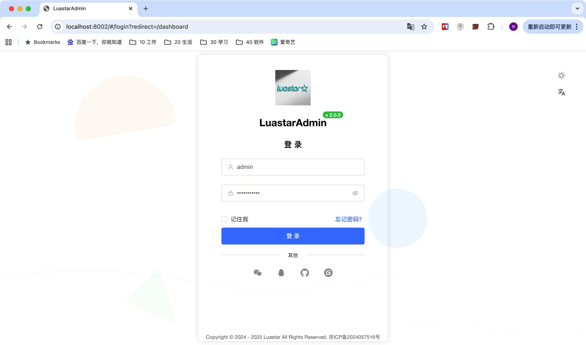

### 📊 监控统计

- **实时监控**：系统性能指标的实时展示
- **历史统计**：按时间维度的数据分析
  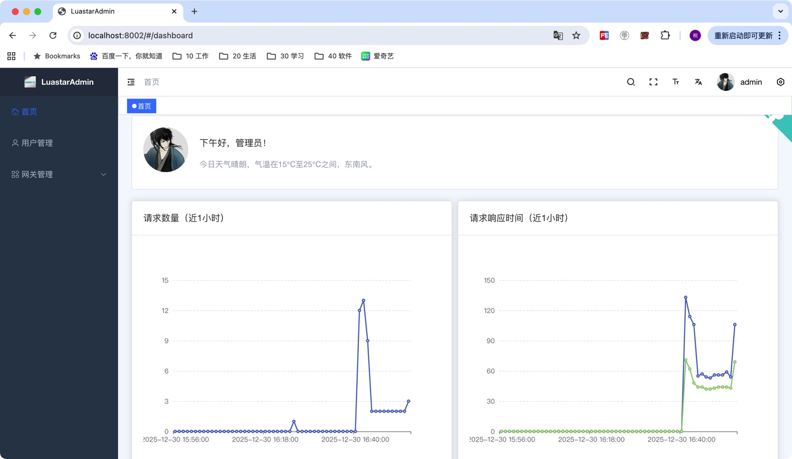
  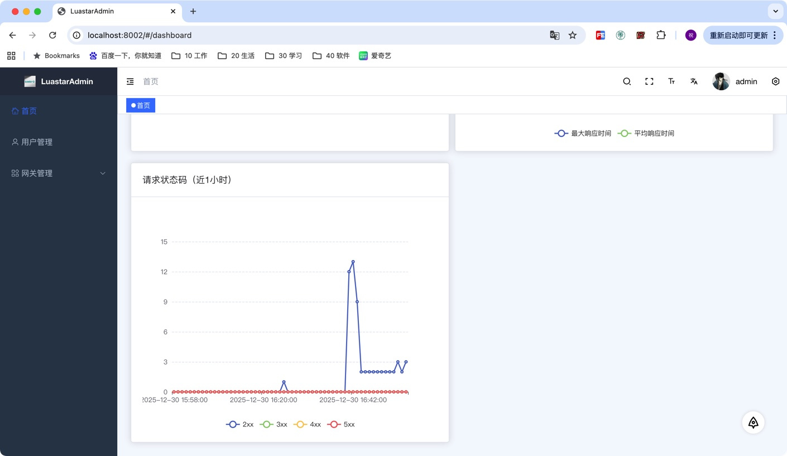

### 👥 用户管理

- **用户管理**：简单的用户管理功能
  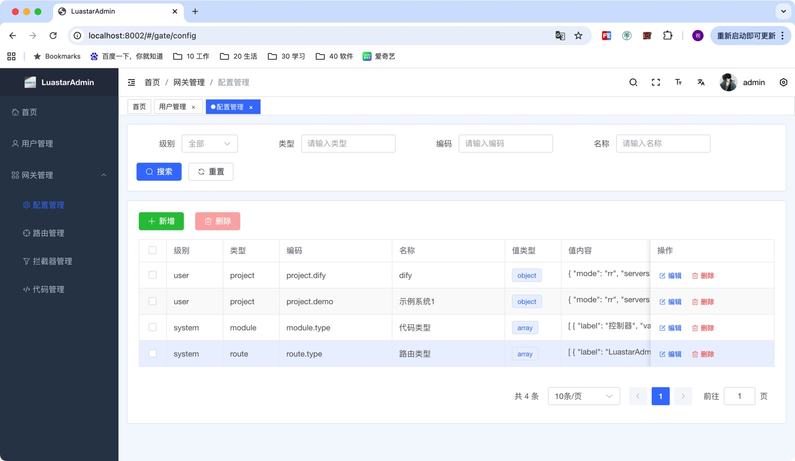
  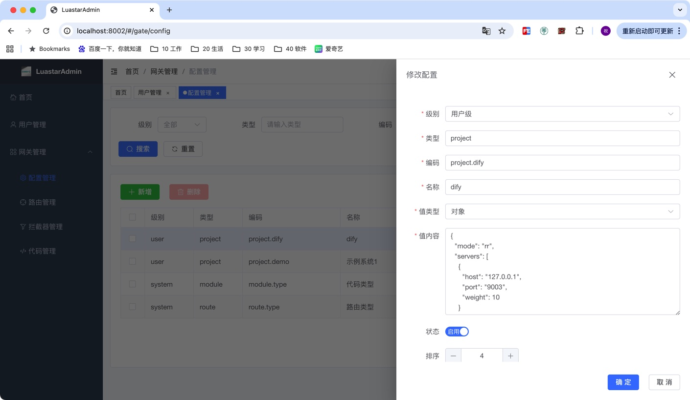

### 🔗 路由管理

- **动态路由**：支持在线添加、修改、删除路由规则
- **负载均衡**：支持多种负载均衡策略（轮询、随机、权重）
  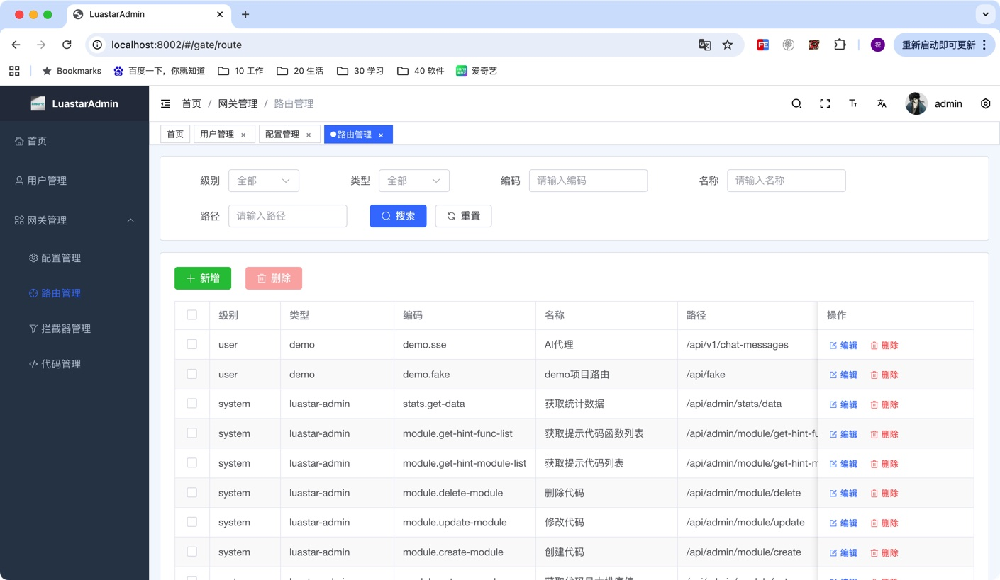
  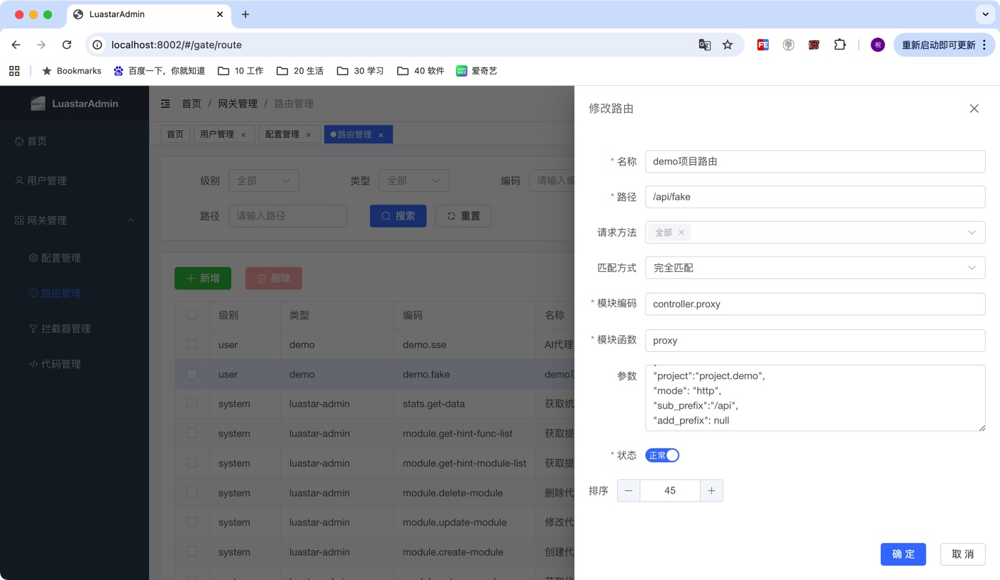

### 🛡️ 拦截器系统

- **认证拦截器**：JWT Token 验证和用户身份识别
- **限流拦截器**：基于 IP、用户、API 的多维度限流
- **熔断拦截器**：防止级联故障的自动熔断机制
  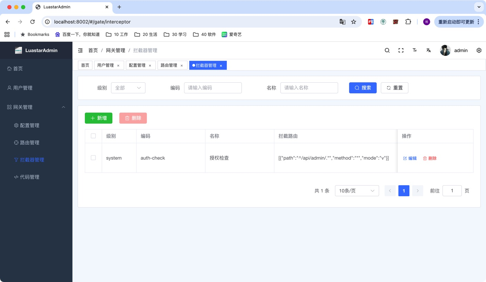
  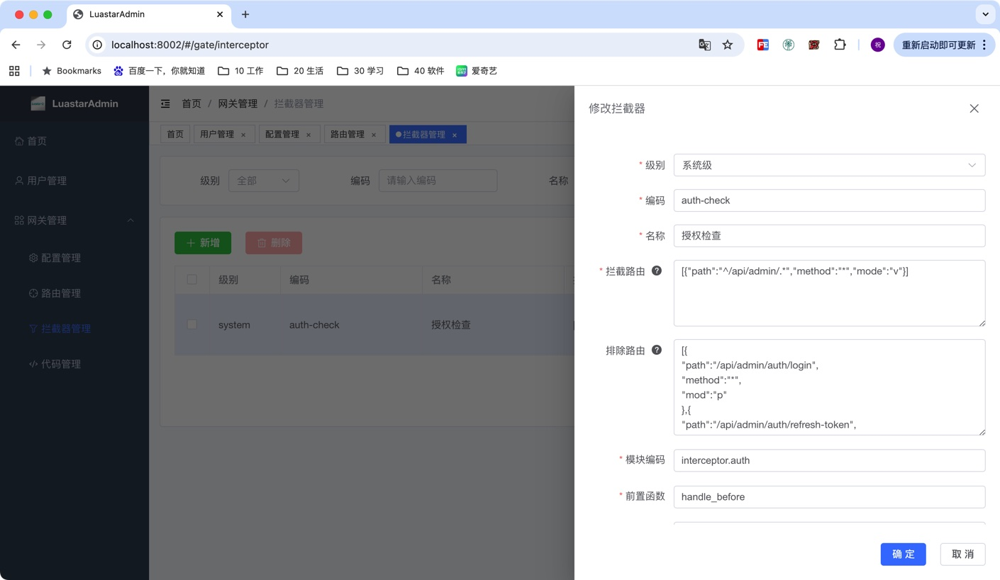

### 💻 代码开发平台

- **在线编辑器**：内置 Lua 代码编辑器，支持语法高亮和自动补全
- **热加载机制**：代码保存后自动重载，无需手动重启服务
  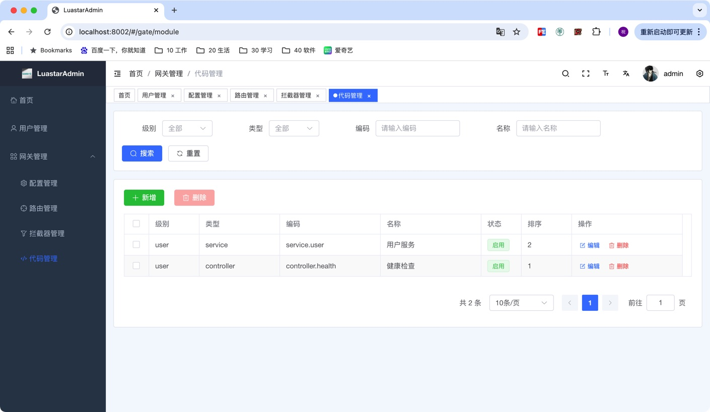
  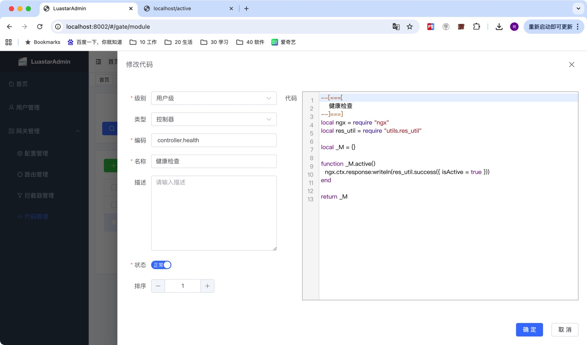

## 💡 在线代码开发示例

### 创建简单的 健康检查 接口

第一步：在代码管理中新增模块 controller.health ：

```lua
--[===[
    健康检查
--]===]
local ngx = require "ngx"
local res_util = require "utils.res_util"

local _M = {}

function _M.active()
  ngx.ctx.response:writeln(res_util.success({ isActive = true }))
end

return _M

```

第二步：在路由管理中新增路由规则：

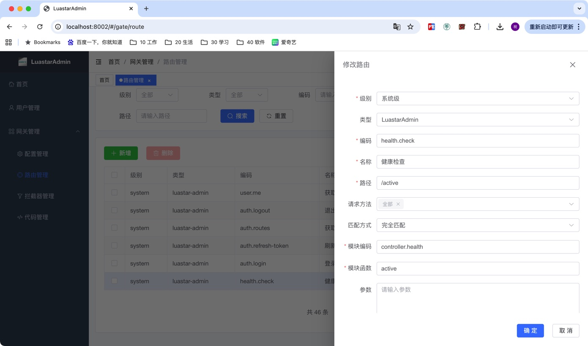

第三步：等待 30 秒（将相关数据从数据库中同步到 openresty 字典，可在 admin-backed/init_worker_by_lua.lua 中修改）
通过 `http://localhost/active` 访问：

```json
{
  "traceId": "f1cdb6dc96e5d401a856ff3a",
  "success": true,
  "data": {
    "isActive": true
  }
}
```

### 数据库查询示例

第一步：在代码管理中新增模块 controller.user ：

```lua
--[===[
  用户模块
--]===]
local ngx = require "ngx"
local module = require "core.module"
local res_util = require "utils.res_util"
local str_util = require "utils.str_util"
local error_util = require "utils.error_util"

local _M = {}

--[[
  获取用户列表
--]]
function _M.get_user_list()
  -- 获取查询参数
  local params = ngx.ctx.request:get_body_json() or {}
  -- 从数据库获取用户列表
  local user_service = module.require("service.user")
  local call_err = ""
  local ok, count, list = xpcall(
    user_service.get_user_count_and_list,
    function(err) call_err = error_util.get_msg(err) end,
    params
  )
  if not ok then
    ngx.ctx.response:writeln(res_util.failure(call_err))
    return
  end
  -- 返回结果
  ngx.ctx.response:writeln(res_util.success({ total = count, list = list }))
end

return _M

```

第二步：在代码管理中新增模块 service.user ：

```lua
--[===[
    用户管理服务
--]===]
local ngx = require "ngx"
local sql_util = require "utils.sql_util"
local str_util = require "utils.str_util"
local id_util = require "utils.id_util"
local date_util = require "utils.date_util"
local enum_util = require "utils.enum_util"
local error_util = require "utils.error_util"

local ngx_thread_spawn = ngx.thread.spawn
local ngx_thread_wait = ngx.thread.wait

local _M = {}

--[[
 获取用户数量及列表
--]]
function _M.get_user_count_and_list(params)
  -- 参数默认值
  local keys = { "username", "nickname", "email" }
  for i, k in ipairs(keys) do
    if _.isEmpty(params[k]) then
      params[k] = nil
    end
  end
  if _.isEmpty(params["pageNum"]) then
    params["pageNum"] = 1
  end
  if _.isEmpty(params["pageSize"]) then
    params["pageSize"] = 20
  end
  -- mysql 服务
  local mysql_service = ls_cache.get_bean("mysql_service")
  -- 查询条件
  local sql_query_where = {
    [[ `username` like concat('%',#{username},'%') ]],
    [[ and `nickname` like concat('%',#{nickname},'%') ]],
    [[ and `email` like concat('%',#{email},'%') ]],
  }
  local sql_params = {
    username = params["username"],
    nickname = params["nickname"],
    email = params["email"],
    limit = params["pageSize"],
    offset = (params["pageNum"] - 1) * params["pageSize"]
  }
  -- 查询总数
  local thread_query_count = ngx_thread_spawn(function()
    local sql_query_count = sql_util.fmt_sql_table({
      sql = [[ select count(*) as total from ls_user @{where}; ]],
      where = sql_query_where
    }, sql_params)
    local res, err, errcode, sqlstate = mysql_service:query(sql_query_count)
    if not res then
      logger.error("查询用户数量失败: err = ", err, ", errcode = ", errcode, ", sqlstate = ", sqlstate)
      error_util.throw("查询用户数量失败 : " .. err)
    end
    return tonumber(res[1]["total"])
  end)
  -- 查询列表
  local thread_query_list = ngx_thread_spawn(function()
    local sql_query_list = sql_util.fmt_sql_table({
      sql = [[ select * from ls_user @{where} order by `rank` desc @{limit}; ]],
      where = sql_query_where,
      limit = { limit = "${limit}", offset = "${offset}" }
    }, sql_params)
    local res, err, errcode, sqlstate = mysql_service:query(sql_query_list)
    if not res then
      logger.error("查询用户列表失败: err = ", err, ", errcode = ", errcode, ", sqlstate = ", sqlstate)
      error_util.throw("查询用户列表失败 : " .. err)
    end
    return res
  end)
  -- 等待查询结果
  local ok1, res1 = ngx_thread_wait(thread_query_count)
  local ok2, res2 = ngx_thread_wait(thread_query_list)
  if not ok1 or not ok2 then
    error_util.throw("查询用户列表失败")
  end
  return res1, res2
end

return _M

```

第三步：在路由管理中新增路由规则：
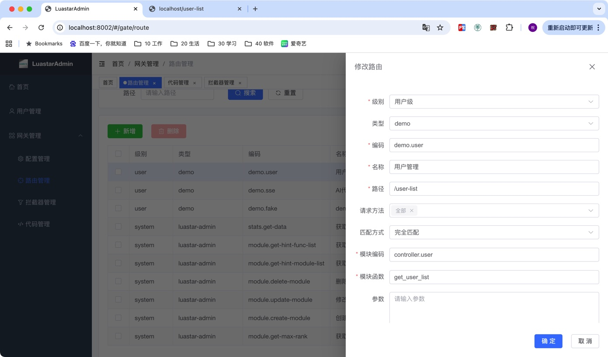

第四步：等待 30 秒
通过 `http://localhost/user-list` 访问：

```json
{
  "data": {
    "list": [
      {
        "passwd": "bce7176ba73b5342f0e65eb5a00f6f5623571df696d797846f081a3251c39a48",
        "update_by": "admin",
        "email": "5917332@qq.com",
        "level": "user",
        "update_at": "2025-05-21 14:38:22",
        "id": "682d822359fa5227368b6a02",
        "create_at": "2025-05-21 14:28:20",
        "rank": "2",
        "state": "enable",
        "username": "common",
        "nickname": "普通用户",
        "avatar": null,
        "roles": "common",
        "create_by": "admin"
      },
      {
        "passwd": "ac0e7d037817094e9e0b4441f9bae3209d67b02fa484917065f71b16109a1a78",
        "update_by": "admin",
        "email": "19102630@163.com",
        "level": "system",
        "update_at": "2025-04-18 16:31:38",
        "id": "682d822359fa5227368b6a01",
        "create_at": "2025-04-18 16:31:31",
        "rank": "1",
        "state": "enable",
        "username": "admin",
        "nickname": "管理员",
        "avatar": "https://avatars.githubusercontent.com/u/44761321",
        "roles": "admin",
        "create_by": "admin"
      }
    ],
    "total": 2
  },
  "traceId": "fe74a08344249a243c33a1ec",
  "success": true
}
```

### 其他示例

可以参考后台管理相关功能的实现，在 admin-backend/src/modules/ 下找到。

## 🎯 使用场景

### 微服务网关

- 作为微服务架构的统一入口
- 提供服务发现和路由转发
- 实现服务间的负载均衡

### API 管理平台

- 统一管理所有 API 接口
- 提供 API 版本控制
- 实现 API 访问统计和分析

## 🤝 贡献指南

我们欢迎社区贡献！请阅读以下指南：

## 📄 许可证

本项目采用 [MIT License](LICENSE) 开源协议。

## 🙏 致谢

感谢相关开源项目的支持：

## 📞 联系我们

- **项目主页**：https://github.com/luastar/luastar
- **文档中心**：https://docs.luastar.io
- **问题反馈**：https://github.com/luastar/luastar/issues
- **讨论社区**：https://github.com/luastar/luastar/discussions

---

<div align="center">
  <p>如果这个项目对你有帮助，请给我们一个 ⭐️</p>
  <p>Made with ❤️ by Luastar Team</p>
</div>
